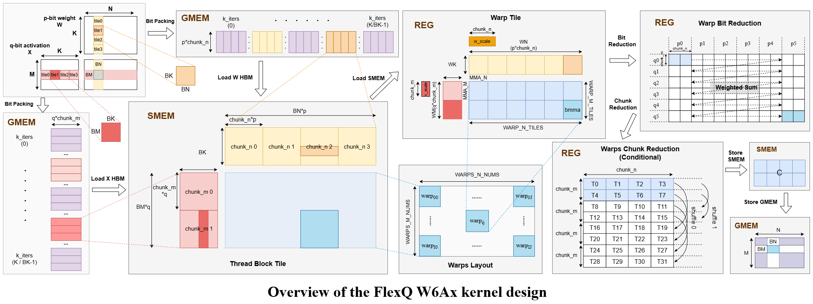
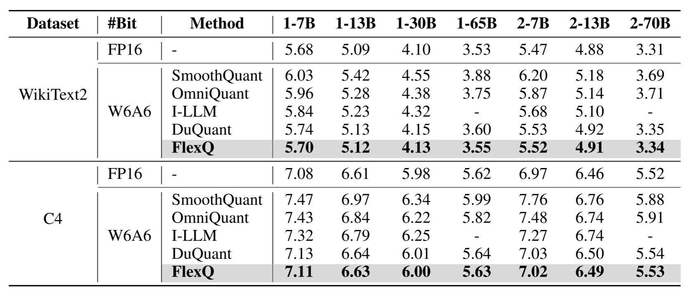
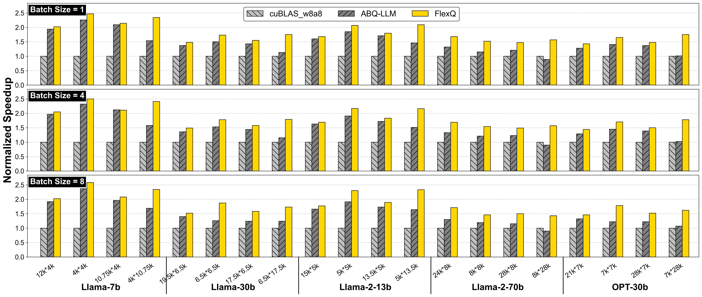
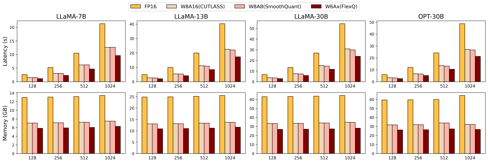

<h1 align="center">FlexQ: Efficient Post-training INT6 Quantization for LLM Serving via Algorithm-System Co-Design</h1>
FlexQ is a novel and efficient post-training INT6 quantization framework tailored for LLM inference. It combines the following design methodologies: (1) weight & activation fine-grained group quantization; (2) selective High-Precision Activation Quantization for Sensitive Network Layers; (3) dynamic activation quantization and bit-level data packing; (4) efficient W6Ax CUDA kernels co-design.



## Abstract
Large Language Models (LLMs) demonstrate exceptional performance but entail significant memory and computational costs, restricting their practical deployment. While existing INT4/INT8 quantization reduces these costs, they often degrade accuracy or lack optimal efficiency. INT6 quantization offers a superior trade-off between model accuracy and inference efficiency, but lacks hardware support in modern GPUs, forcing emulation via higher-precision arithmetic units that limit acceleration. 

In this paper, we propose FlexQ, a novel post-training INT6 quantization framework combining algorithmic innovation with system-level optimizations. FlexQ employs uniform 6-bit weight quantization across all layers, with adaptive retention of 8-bit activations in layers identified through layer-wise sensitivity analysis. To maximize hardware efficiency, we develop a specialized high-performance GPU kernel supporting matrix multiplication for W6A6 and W6A8 representations via Binary Tensor Core (BTC) equivalents, effectively bypassing the lack of native INT6 tensor cores. Evaluations on LLaMA models show FlexQ maintains near-FP16 accuracy, with perplexity increases of no more than 0.05. The proposed kernel achieves an average 1.39× speedup over ABQ-LLM on LLaMA-2-70B linear layers. End-to-end, FlexQ delivers 1.33× inference acceleration and 1.21× memory savings over SmoothQuant.

## Install
1. Clone this repository
```
git clone https://github.com/FlyFoxPlayer/FlexQ.git
cd FlexQ
```

2. Installation of the runtime environment
```
conda create -n flexq python=3.10
conda activate flexq

cd ./FlexQ/algorithm
pip install --upgrade pip 
pip install -r requirements.txt
```


## Usage
### Accuracy Evaluation
We provide several scripts to reproduce the results in our paper.
You can execute the following scripts to complete the **FP16** Accuracy Evaluation.
```
python main.py --model /Path/To/Model \
--eval_ppl --tasks piqa,arc_easy,arc_challenge,boolq,hellaswag,winogrande
```
You can execute the following scripts to complete the **FlexQ W6Ax** Accuracy Evaluation.
```
python main.py --model /Path/To/Model \
--wbits 6 --abits 6 --w_group_size 128 --a_group_size 128 \
--flex_linear_quant --symmetric \
--eval_ppl --tasks piqa,arc_easy,arc_challenge,boolq,hellaswag,winogrande
```
The following describes critical configuration parameters:
- `--model`: the local model path or huggingface format.
- `--wbits`: weight quantization bits.
- `--abits`: activation quantization bits.
- `--group_size`: group size for weight/activation quantization. If unset, defaults to per-channel quantization.
- `--symmetric`: use symmetric quantization. If unset, defaults to asymmetric quantization.
- `--flex_linear_quant`: Enables high-precision activation quantization for critical sensitivity layers. If unset, uniformly quantizes all layers based on `--wbits` and `--abits` by default.
- `--eval_ppl`: evaluating the perplexity of quantized models.
- `--tasks`: evaluating zero-shot tasks.


### Kernel Benchmark
Please complete the compilation of the FlexQ kernel first:
```
cd ./FlexQ/engine
bash build.sh
```
To obtain benchmark results for the cuBLAS(W8A8) kernel, please execute:
```
bash test_cublas_kernel.sh
```
To obtain benchmark results for the FlexQ kernel, please execute:
```
bash test_flexq_kernel.sh
```

### FasterTransformer E2E performance
Due to the complexity of the FasterTransformer end-to-end codebase, we are currently planning a major code refactoring to eliminate redundancy and improve readability. Please stay tuned for future updates.


## Results
### Accuracy Evaluation 
FlexQ achieves state-of-the-art (SoTA) accuracy performance at W6A6 precision. We evaluated the perplexity performance of FlexQ on the LLaMA family and OPT models.


Additionally, we further provide the performance of FlexQ on zero-shot common sense tasks.


### Kernel Performance 
FlexQ maintains superior performance across all tested LLM workloads. Specifically, with batch sizes of 1, 4, and 8, FlexQ achieves average speedups of 1.78×, 1.81×, and 1.82× over cuBLAS, and 1.24×, 1.24×, and 1.27× over ABQ-LLM, respectively.


### E2E Performance
We evaluate the end-to-end performance of FlexQ in LLaMA family and OPT models. Results on the LLaMA-13B model demonstrate that FlexQ achieves up to 2.38× inference acceleration and 2.28× memory compression relative to FP16. FlexQ delivers 1.25–1.33× speedup and 1.19–1.24× reduction in memory footprint compared to SmoothQuant.


## Acknowledgement
This repo benefits from [ABQ-LLM](https://github.com/bytedance/ABQ-LLM.git). We extend our sincere gratitude for their wonderful work.

## Citation
If you use our FlexQ approach in your research, please cite our paper:
```
```
